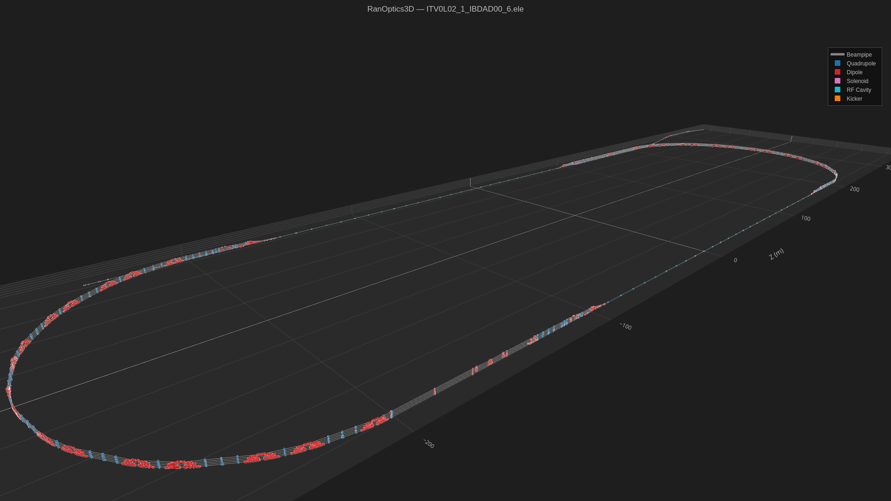
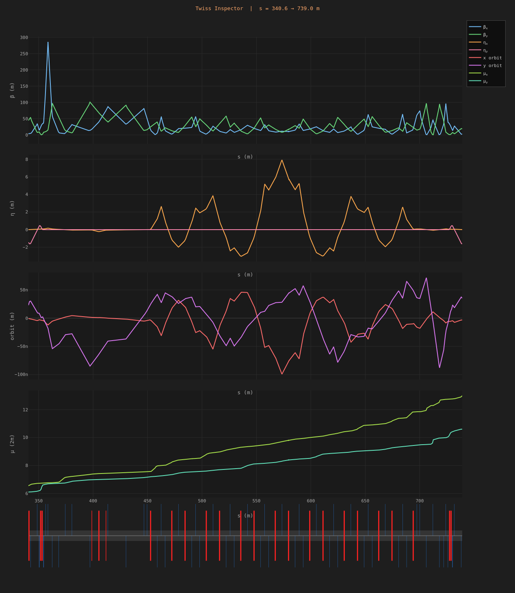
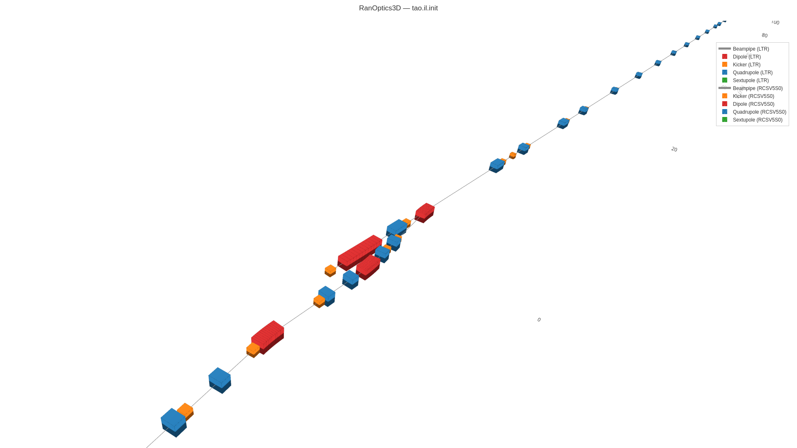

# Examples

!!! tip "These plots are fully interactive"
    Click the links below to open the live HTML version. You can rotate, pan, zoom,
    hover over elements, and use the in-browser control panel. See the
    [3D Viewer](guide/viewer.md) guide for details.

---

## CEBAF Full Lattice

Full CEBAF ring rendered from ELEGANT (ITV0L02_1_IBDAD00_6.ele), showing all
dipoles, quadrupoles, solenoids, RF cavities, and kickers.

[Open interactive plot](assets/CEBAF_3D.html){ .md-button }

---

## CEBAF Arc 1 — Twiss Inspector

Twiss Inspector output for Arc 1 (s = 340.6 → 739.0 m), showing β functions,
dispersion, closed orbit, and phase advance.

---

## LTR Beamline

LTR beamline rendered from Tao (tao.il.init), with multi-universe overlay showing
both LTR and RCSV5S0 universes.

[Open interactive plot](assets/LTR_3D.html){ .md-button }
