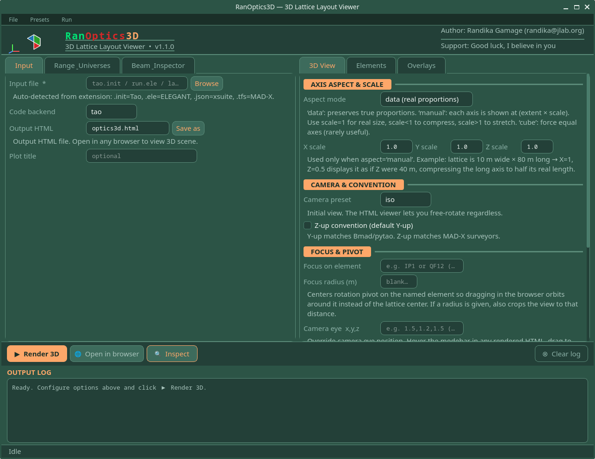

# GUI Walkthrough

The GUI is split into two panels. The **left panel** controls what to load and how to interpret the beam. The **right panel** controls how the 3D scene is rendered. Configure both before clicking **▶ Render 3D**.

---

## Left Panel

### Input Tab

Select your backend, point to your input file, and configure output.

| Control | Description |
|---|---|
| **Input file** | Path to your lattice file — see [Supported Backends](../reference/backends.md). Auto-detected from extension: `.init` → Tao, `.ele` → ELEGANT, `.json` → xsuite, `.tfs` → MAD-X |
| **Code backend** | Backend override. Normally auto-detected — only set manually if your file has a non-standard extension |
| **Output HTML** | Filename for the generated `.html` file. Open in any browser to view the 3D scene |
| **Save as** | Choose a different output path or filename |
| **Plot title** | Optional title embedded in the rendered HTML |

---

### Range & Universes Tab

For multi-universe lattices such as Tao configurations with multiple rings.

| Control | Description |
|---|---|
| **Universe selector** | Choose which universes to include in the plot |
| **s-range** | Restrict the rendered lattice to a specific s interval (meters) |

!!! note
    For single-universe lattices (most ELEGANT and MAD-X cases) this tab can be left at defaults.

---

### Beam & Inspector Tab

| Control | Description |
|---|---|
| **εx, εy** | Horizontal and vertical normalized emittances for beam size calculations |
| **Energy spread** | σ_δ used for the σ tube overlay |
| **Optics panels** | Toggle which plots appear in the Twiss Inspector: β, σ, η, orbit, phase advance |
| **σ tube** | Enable/disable the 3D beam envelope tube overlay |
| **Magnet size file** | Load a definition file to override element box dimensions — see [Magnet Size File](../reference/magnet-size-file.md) |

---

## Right Panel

### 3D View Tab

Controls the overall appearance and camera behavior of the rendered scene.

#### Axis Aspect & Scale

| Control | Description |
|---|---|
| **Aspect mode** | `data` preserves true proportions. `manual` lets you scale each axis independently using the X/Y/Z scale fields. `cube` forces equal axes (rarely useful) |
| **X / Y / Z scale** | Active only in `manual` mode. Scale < 1 compresses an axis, scale > 1 stretches it. Useful when a lattice is very long in one dimension — e.g. set Z=0.5 to display an 80 m lattice as if it were 40 m long |

#### Camera & Convention

| Control | Description |
|---|---|
| **Camera preset** | Initial view on load: `iso`, `top`, `side`, or `front`. The HTML viewer allows free rotation regardless of this setting |
| **Z-up convention** | When checked, Z is the vertical axis (matches MAD-X surveyors). Default is Y-up, which matches Bmad/pytao |

#### Focus & Pivot

| Control | Description |
|---|---|
| **Focus on element** | Element name to center the rotation pivot on (e.g. `IP1`, `QF12`). Dragging in the browser will orbit around that element instead of the lattice center |
| **Focus radius (m)** | If set, also crops the view to within this radius of the focus element |
| **Camera eye x,y,z** | Override the camera eye position directly. Hover the modebar in any rendered HTML, drag to your preferred view, then read the eye position from the toolbar tooltip and paste here for exact reproducibility |

#### Theme

| Control | Description |
|---|---|
| **Dark mode** | Renders the scene with a dark background |
| **Show XYZ axis gizmo at origin** | Displays a small XYZ orientation indicator at the world origin |
| **Embed live control panel in HTML** | Adds an interactive sidebar to the rendered HTML — no re-render needed to use it. See [Live Control Panel](#live-control-panel) below |

#### Beampipe

| Control | Description |
|---|---|
| **Show beampipe centerline** | Draws a line along the beam path through the lattice |
| **Pipe color** | Hex color for the centerline (default `#888888`) |
| **Width** | Line width of the beampipe centerline |

---

### Elements Tab

Controls the geometry and visibility of individual element types in the 3D scene.

#### Element Box Size

| Control | Description |
|---|---|
| **Half-width (m)** | Transverse horizontal half-size of element boxes in beam-frame coordinates. Tune smaller for tight lattices, larger for visibility |
| **Half-height (m)** | Transverse vertical half-size of element boxes |

#### Bend Smoothness

| Control | Description |
|---|---|
| **Segments per bend** | Number of straight segments used to approximate each dipole arc. Higher values produce smoother curves but increase file size and render time |

#### Visibility & Opacity

Each element type (Dipole, Quadrupole, Sextupole, Octupole, Kicker, Monitor, RF Cavity, Solenoid, Marker) has a checkbox and an opacity slider.

| Control | Description |
|---|---|
| **Checkbox** | Uncheck to hide that element type entirely |
| **Opacity** | 0.0–1.0. Partial values fade elements — useful for focusing attention on specific magnet families |
| **Include markers/monitors as boxes** | Markers and monitors are zero-length elements; by default they are not drawn as boxes. Enable this to render them as small boxes |
| **Show element outlines** | Draws white edge lines on element boxes. Turn off to hide segment outlines on curved dipoles for a cleaner look |

#### Mirror

| Control | Description |
|---|---|
| **Flip bend direction (mirror X)** | Mirrors the lattice layout along X. Useful when the survey coordinate handedness doesn't match your expected orientation |

---

### Overlays Tab

Controls additional geometry overlaid on the 3D scene.

#### Element Annotations

| Control | Description |
|---|---|
| **Pattern** | Comma-separated wildcard patterns matching element names (e.g. `IPM*, BPM*, IP*`). Adds floating 3D text labels at all matching elements |
| **Font size** | Size of the 3D annotation text |

#### Tunnel Wall

| Control | Description |
|---|---|
| **Wall coord file** | Path to a `.dat` file defining the tunnel wall geometry. Format: one line per point — `x_in y_in z_in x_out y_out z_out` |
| **Draw tunnel wall** | Enable/disable rendering of the tunnel wall surface |

#### Ground Plane

| Control | Description |
|---|---|
| **Draw ground plane** | Renders a flat ground plane at the specified Y position |
| **Ground Y position** | Vertical position of the ground plane in survey coordinates |
| **Show grid on ground** | Overlays a grid on the ground plane for spatial orientation. Place it at the floor of your tunnel |

---

## Bottom Bar

| Control | Description |
|---|---|
| **▶ Render 3D** | Build the full 3D scene and write the output HTML file |
| **Open in browser** | Open the last rendered HTML file in your default browser |
| **Inspect** | Dry-run that loads the lattice and reports element counts by type without rendering. Useful for verifying the correct file and universe are loaded before a full render |
| **Clear log** | Clear the output log panel |

---

## Live Control Panel

When **Embed live control panel in HTML** is enabled in the 3D View tab, the rendered HTML includes a collapsible sidebar with real-time controls — no re-render required.

| Section | Controls |
|---|---|
| **Element Types** | Per-type visibility checkboxes and opacity sliders — same as the Elements tab but adjustable live in the browser |
| **Highlight Elements** | Wildcard name pattern to highlight matching elements (e.g. `BPM*`, `IP1`) |
| **Camera** | Rotation/zoom instructions, preset view buttons (Iso, Top, Side, Front), and Screenshot |
| **Aspect (X / Y / Z)** | Live axis scale sliders. Compresses or stretches axes without re-rendering. Note: element boxes do not resize — only the spacing scales |
| **Twiss Inspector** | Click any element in the scene to set it as Start or End, then open the inspector. Or type element names or s-values directly |
| **Twiss σ Tube** | Reminder to set εx/εy in the GUI and re-render if no beta data is present |
| **Overlays** | Toggle Beampipe, Axes gizmo, and Grid live |
| **Annotations** | Wildcard pattern for live element labels — updates without re-rendering |
| **Selected Element** | Click any element in the scene to pin its name and properties here |
| **Reset all** | Resets all live panel controls to their render-time defaults |